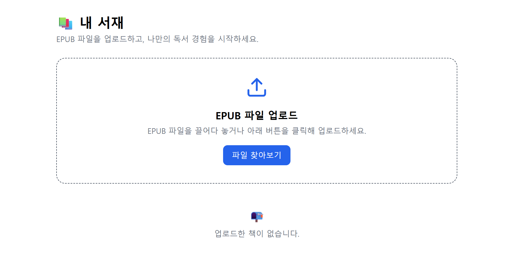
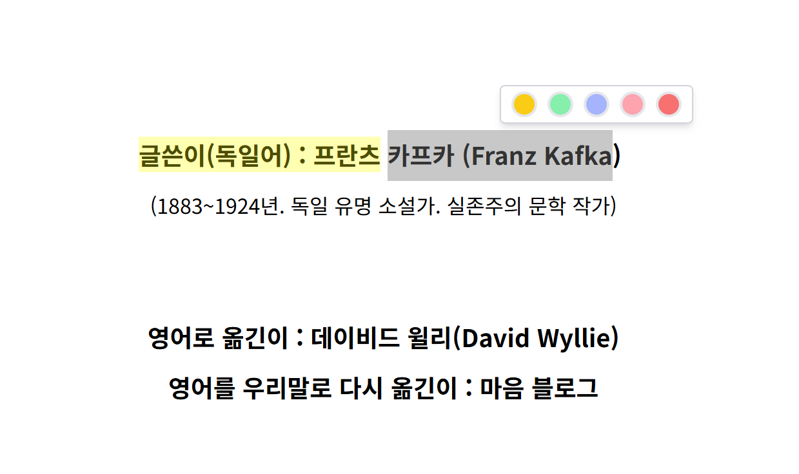
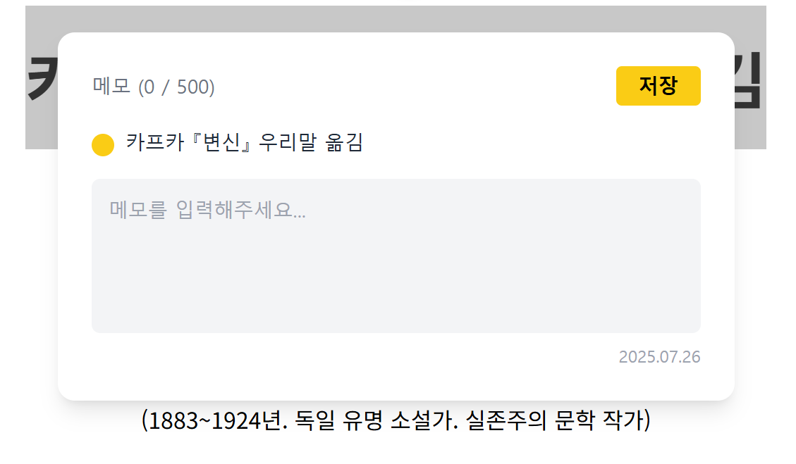

<p align="center">
  
</p>

**record247**은 사용자의 **텍스트 드래그, 클릭, 메모 입력 등 인터랙션을 빠르고 정확하게 기록**하는  
웹 기반의 **독서 지원 애플리케이션**입니다.

<br />

# 목차
- [기획 의도](#기획-의도)
- [프리뷰](#프리뷰)
- [기술적 과제 & 해결](#기술적-과제--해결)
  1. [EPUB 구조 검증](#1-epub-구조가-잘못된-파일은-왜-사전에-차단해야-했을까)
  2. [서버 저장 및 접근 방식 개선](#2-epub-파일을-서버에-안전하게-저장하고-url로-접근-가능하게-만들었습니다)
  3. [커스터마이징 전자책 뷰어 구현](#3-react-reader를-제거하고-epubjs를-직접-제어한-이유와-방식)
  4. [클라이언트 중심 하이라이트/메모 동기화](#4-하이라이트와-메모-기능은-왜-클라이언트-중심-동기화-구조로-전환했을까)
  5. [중복 방지 및 지연 저장 처리](#5-하이라이트-기능의-중복-저장과-지연-저장은-왜-별도로-다뤘을까)
  6. [툴바 위치 정밀 제어](#6-툴바는-어떻게-하이라이트-위에-정확히-위치하도록-만들었을까)
- [기술 스택](#기술-스택)
- [구조 설계](#구조-설계)
- [회고](#회고)

<br />

# 기획 의도

> **“내가 남긴 메모가 먼저 나를 찾아온다면?”**

책을 읽다 마음을 울리는 문장을 만나면 우리는 밑줄을 긋고 메모를 남깁니다.
하지만 그 기록을 다시 꺼내 보는 일은 많지 않죠.
**앱을 열고, 책을 다시 찾고, 페이지를 넘기는 과정이 번거롭기 때문입니다.**

그렇게 남긴 생각과 밑줄은
어딘가 저장되지만 **기억되지 않은 채** 사라져버리곤 합니다.

**record247**은 그 공백을 메우고자 시작되었습니다.
단순히 기록하는 것을 넘어, **기억으로 이어지는 독서 경험**을 만들고자 합니다.

<br />

# 프리뷰

| 화면                                                                        | 설명                                                                                               |
| --------------------------------------------------------------------------- | -------------------------------------------------------------------------------------------------- |
|     | **EPUB 업로드 화면**<br/>EPUB 파일 업로드 후 구조 검사를 통과하면 전자책 뷰어로 이동합니다.        |
|  | **하이라이트 기능**<br/>텍스트 드래그 시 툴팁이 나타나고 중복 없이 하이라이트가 생성됩니다.        |
|       | **메모 작성 창**<br/>하이라이트에 메모 버튼을 누르면 선택 텍스트와 함께 내용을 입력할 수 있습니다. |

<br />

# 핵심 기능과 흐름

**EPUB**은 다양한 디지털 기기에서 쉽게 읽을 수 있도록 설계된 전자책 파일 형식으로, 텍스트, 이미지, 스타일(HTML/CSS), 메타데이터 등을 포함하며 전자책 리더 소프트웨어나 하드웨어에서 사용됩니다.

사용자는 직접 `.epub` 전자책 파일을 업로드하고, 브라우저에서 바로 읽을 수 있습니다.
이 핵심 기능은 다음과 같은 흐름으로 작동합니다:

1. **파일 업로드**
   사용자가 EPUB 파일을 업로드
2. **서버 유효성 검사 및 저장**
   Firebase Functions에서 파일을 ZIP으로 해석한 뒤,
   `mimetype`, `container.xml`, `content.opf` 등 핵심 구조를 검사
   유효한 경우 Firebase Storage에 저장
3. **Signed URL 발급**
   저장된 파일에 대해 일정 시간 동안 유효한 **서명된 접근 URL**을 생성해
   클라이언트에 전달합니다.
4. **epub.js로 렌더링**
   클라이언트는 전달받은 URL을 `epub.js`에 전달해
   브라우저 내에서 전자책을 렌더링
5. **읽기 위치 및 메모 저장**
   사용자의 독서 위치(CFI)와 하이라이트, 메모는 로컬에 즉시 저장되며,
   이후 주기적으로 서버와 동기화

<br />

# 문제 해결과 구현 과정

record247은 사용자가 올리는 다양한 EPUB 파일을 웹 브라우저에서 안정적으로 읽고, 메모/하이라이트 기능을 자연스럽게 사용할 수 있도록 기술적인 설계에 많은 고민을 담았습니다. 특히 **불완전한 EPUB 파일 처리**, **파일 접근 방식**, **커스터마이징 가능한 뷰어**, **메모/하이라이트 동기화 전략**은 이 프로젝트의 주요 기술 과제였습니다.

## 1. EPUB 구조가 잘못된 파일은 왜 사전에 차단해야 했을까?

사용자들이 업로드한 EPUB 파일 중에는 실제 전자책 구조를 따르지 않고, 단순히 확장자만 `.epub`으로 변경된 경우가 많았습니다.<br />
이러한 파일은 전자책 뷰어에서 렌더링에 실패하며, 앱이 흰 화면으로 멈추거나 콘솔 로그조차 출력되지 않아 디버깅이 매우 어렵습니다.<br />
이 문제를 해결하기 위해, 클라이언트와 서버 양쪽에서 EPUB 구조를 검증하는 **이중 유효성 검사 방식**을 도입하였습니다.

### **[의문] 단순히 확장자만 확인하는 것으로는 충분하지 않을까?**

- EPUB 파일은 ZIP 구조를 기반으로 하며, `mimetype`, `META-INF/container.xml` 등의 필수 파일이 반드시 존재해야 합니다.
- 이러한 구조가 누락된 경우, `epub.js`는 렌더링을 시작하지 못하고 오류가 발생합니다.
- 구조 오류가 있는 파일이 서버까지 업로드될 경우, 서버 자원이 낭비되고 사용자 경험이 크게 저하됩니다.
- 특히 콘솔에 에러 로그가 찍히지 않아 문제의 원인을 찾기도 어렵습니다.

### **[해결] 클라이언트와 서버에서 이중으로 구조를 검사합니다**

단일 단계의 검증으로는 부족하다고 판단하였고, <br />
클라이언트에서 1차 검사 → 서버에서 2차 검증을 수행하는 방식으로 설계하였습니다.

### 클라이언트 측 검사 (JSZip 사용)

- 사용자가 EPUB 파일을 업로드하면, JSZip으로 압축을 해제하고 내부 파일 구조를 점검합니다.
- `mimetype` 파일이 존재하는지, 그 내용이 `application/epub+zip`으로 정확한지 확인합니다.
- `META-INF/container.xml` 파일의 존재 여부도 검사합니다.

  ```js
  // EPUB 내부에서 mimetype 파일을 비동기 텍스트로 읽음
  const mimetype = await zip.file('mimetype')?.async('text');

  // mimetype 내용이 정확하지 않으면 업로드 거부
  if (mimetype?.trim() !== 'application/epub+zip') {
    throw new Error('올바르지 않은 EPUB 파일입니다');
  }
  ```

- 구조에 문제가 발견되면 서버 전송을 차단하고, 사용자에게 즉시 오류 메시지를 안내합니다.

### 서버 측 검사 (Firebase Functions 사용)

- 클라이언트 검사를 통과한 파일만 서버로 전달됩니다.
- Firebase Functions에서는 `container.xml`을 파싱하여 `.opf` 파일 경로를 추출한 후, 그 내부에 `manifest`, `spine` 등의 핵심 요소가 포함되어 있는지를 확인합니다.

  ```js
  // EPUB 내부의 container.xml을 읽어서 파싱
  const containerXml = await zip.file('META-INF/container.xml')?.async('text');

  // XML 형식을 JS 객체로 변환 (ex. opf 경로 추출 목적)
  const parsed = await parseStringPromise(containerXml);
  ```

### **[결과] 비정상 EPUB 파일을 사전에 차단하여 앱 안정성을 높였습니다**

- 렌더링 실패 가능성이 높은 EPUB 파일을 클라이언트 단계에서 빠르게 차단할 수 있게 되었습니다.
- 서버 리소스 낭비를 줄이고, 사용자에게는 명확하고 즉각적인 피드백을 제공할 수 있었습니다.
- 이중 검증 과정을 통해 구조적으로 안정적인 EPUB만 수용함으로써 전체 사용자 경험과 서비스 품질이 모두 향상되었습니다.

<br />

## 2. EPUB 파일을 서버에 안전하게 저장하고, URL로 접근 가능하게 만들었습니다.

초기에는 사용자가 업로드한 EPUB 파일을 클라이언트에서 Blob URL로 생성하여 바로 epub.js에 전달하는 방식으로 전자책을 렌더링했습니다.
이 방식은 빠르게 결과를 확인할 수 있다는 장점이 있었지만, 여러 문제를 동반했습니다.

가장 큰 이슈는 새로고침이나 다른 기기에서 접속할 경우, 이전에 업로드한 파일이 사라져 다시 업로드해야 한다는 점이었습니다.
또한 EPUB 내부에 포함된 이미지, 스타일시트 등의 리소스가 Blob URL 경로와 맞지 않아 렌더링이 실패하는 경우도 빈번하게 발생했습니다.

이러한 한계를 극복하기 위해, 서버에 파일을 저장하고, 사용자가 접근할 수 있는 서명된 접근 URL(Signed URL)을 발급해주는 구조로 개선하였습니다.

### **[문제] Blob URL 기반 구조는 지속성과 확장성에 한계가 있었습니다.**

- Blob URL은 휘발성이 있어 새로고침하거나 세션이 종료되면 사용할 수 없습니다.
- 클라이언트 메모리 상의 파일이기 때문에, 다른 기기나 브라우저에서 동일한 파일에 접근할 수 없습니다.
- EPUB 내부 리소스(이미지, CSS 등)는 상대 경로로 연결되어 있어, Blob URL 기반으로는 경로가 깨지고 렌더링에 실패하는 경우가 많았습니다.

### **[해결] Firebase Storage에 파일을 저장하고, Signed URL을 발급하는 방식으로 전환했습니다.**

Firebase Functions와 Storage를 활용하여, 안정적이고 확장 가능한 구조를 설계하였습니다.

### 서버 측 처리 흐름

1. 클라이언트로부터 전송된 EPUB 파일을 받아 구조 검사를 먼저 수행합니다
2. 구조가 유효한 경우, Firebase Storage에 파일을 저장합니다
3. 해당 파일에 대한 일시적인 접근 권한을 가진 Signed URL을 발급하여 클라이언트에 전달합니다

   ```js
   // Firebase Storage 인스턴스 획득
   const bucket = getStorage();

   // 저장할 파일 경로 생성 (사용자 ID, 책 ID 기반으로 구조화)
   const file = bucket.file(`epub/${userId}/${bookId}.epub`);

   // 파일 내용(Buffer)을 실제 Firebase Storage에 저장
   await file.save(fileBuffer);

   // 저장된 파일에 접근할 수 있는 Signed URL 발급
   const [url] = await file.getSignedUrl({
     action: 'read', // 읽기 권한 부여
     expires: Date.now() + 60 * 60 * 1000, // 1시간 유효
   });

   return url; // 클라이언트로 URL 전달
   ```

### 클라이언트 측 처리 흐름

- 서버로부터 전달받은 Signed URL을 `epub.js`에 전달하여 전자책을 렌더링합니다
- EPUB 내부의 이미지나 CSS와 같은 리소스들도 동일한 URL 경로 기준으로 안정적으로 불러올 수 있습니다

  ```js
  // 서버로부터 받은 Signed URL을 사용해 전자책 인스턴스 생성
  book = ePub(signedUrl);

  // 실제 HTML 요소(viewer)에 렌더링 실행
  book.renderTo('viewer');
  ```

### **[결과] 파일에 대한 지속적 접근이 가능해지고, 리소스 렌더링 문제도 해결되었습니다.**

- EPUB 내부 리소스(이미지, 스타일 등)가 정상적으로 렌더링되며, 앱 전체 안정성이 향상되었습니다.
- 사용자는 파일을 한 번만 업로드하면, 이후에는 기기나 브라우저를 변경하더라도 동일한 전자책을 다시 열람할 수 있습니다.
- 인증된 사용자에게만 접근 권한이 부여되며, URL은 일정 시간이 지나면 만료되므로 보안성도 확보됩니다.
- Blob URL 기반 구조의 휘발성과 단절 문제를 해소함으로써, 사용자 경험과 기술적 신뢰성을 동시에 높일 수 있었습니다.

<br />

## 3. react-reader를 제거하고 epub.js를 직접 제어한 이유와 방식

초기에는 `react-reader`라는 라이브러리를 활용하여 전자책 뷰어를 빠르게 구현하였습니다.
그러나 하이라이트, 메모, 목차 클릭과 같은 인터랙션 기능을 구현하려 하자 여러 제약에 부딪혔습니다.
가장 큰 문제는 `react-reader`가 내부적으로 `iframe`을 기반으로 EPUB을 렌더링한다는 점이었습니다.

iframe은 외부 문서를 삽입하는 HTML 요소로, 보안 정책(CSP)나 sandbox 속성으로 인해 다음과 같은 제약이 발생합니다:

- iframe 내부 DOM에 접근할 수 없고,
- JavaScript 실행이 제한되며,
- 이벤트 전달이 차단되며,
- epub.js 인스턴스와의 연결도 불가능해 커스터마이징이 매우 어렵습니다.

결국 원하는 인터랙션 기능을 자유롭게 구현하기 위해 `react-reader`를 제거하고, `epub.js`를 직접 제어하는 방식으로 구조를 변경하였습니다.

### **[문제] react-reader의 iframe 구조는 확장성과 기능 구현에 큰 제약을 주었습니다.**

- 하이라이트 기능을 구현하려 해도 내부 텍스트 DOM에 접근할 수 없었습니다.
- 사용자의 클릭이나 드래그 이벤트가 외부 앱으로 전달되지 않았습니다.
- epub.js의 핵심 인스턴스(rendition)에 접근할 수 없어, 목차 이동이나 메모 삽입 같은 기능 확장이 어려웠습니다.

### **[해결] epub.js를 직접 DOM에 렌더링하고, rendition 인스턴스를 직접 제어하도록 변경하였습니다.**

iframe을 완전히 제거하고, `epub.js`를 직접 불러와 DOM에 렌더링하면서 문제를 해결하였습니다.
이제 내부 인스턴스를 직접 제어할 수 있어 기능 커스터마이징이 자유로워졌습니다.

### epub.js 직접 제어 방식

```js
// epub.js 인스턴스를 생성하고 서버에서 받은 Signed URL을 기반으로 책 로드
book = ePub(signedUrl);

// 'viewer'라는 HTML 요소에 직접 렌더링
rendition = book.renderTo('viewer', {
  manager: 'default', // 페이지 관리 방식 지정 (scroll 대신 페이지 단위 이동)
  flow: 'paginated', // 페이지 넘김 방식 설정 (scroll | paginated 등)
  width: '100%', // 뷰어 가로 크기 (컨테이너에 맞춤)
  height: '100%', // 뷰어 세로 크기 (컨테이너에 맞춤)
});
```

- iframe 없이 렌더링되어 보안 제약 없이 DOM을 자유롭게 조작할 수 있습니다
- rendition 인스턴스를 통해 페이지 이동, 목차 탐색, 하이라이트 삽입 등을 직접 구현할 수 있습니다

### 하이라이트 및 메모 이벤트 연결

```js
// 렌더링이 완료된 후 hook을 통해 각 페이지의 document에 접근
rendition.hooks.render.register((view) => {
  const doc = view.document;

  // .highlight 클래스를 가진 요소들에 대해
  const highlights = doc.querySelectorAll('.highlight');

  // 클릭 이벤트 바인딩 (메모 팝업 등 사용자 인터랙션 실행)
  highlights.forEach((el) => {
    el.addEventListener('click', handleHighlightClick);
  });
});
```

- 하이라이트 요소에 직접 이벤트를 연결하여, 클릭 시 메모 툴팁을 띄우거나 편집 기능을 실행할 수 있습니다

### **[결과] 전자책 뷰어의 확장성과 사용자 인터랙션 구현력이 크게 향상되었습니다.**

- iframe 제거를 통해 보안 제한(CSP) 우회를 실현하고, 자유로운 DOM 접근이 가능해졌습니다.
- epub.js의 기능 전체를 직접 활용할 수 있어 다양한 사용자 기능을 구현할 수 있게 되었습니다.
- 하이라이트, 메모, 목차 이동 등 핵심 인터랙션 기능을 유연하게 제어할 수 있었고,
- 기술적 확장성과 사용자 경험 측면에서 모두 개선된 전자책 뷰어를 완성할 수 있었습니다.

<br />

## 4. 하이라이트와 메모 기능은 왜 클라이언트 중심 동기화 구조로 전환했을까?

전자책을 읽는 사용자는 텍스트를 드래그해 하이라이트를 추가하거나, 해당 위치에 메모를 남기는 동작을 자주 반복합니다.
이러한 상호작용은 단순히 데이터를 저장하는 것을 넘어, **즉각적인 반응성과 저장 신뢰성**을 동시에 요구합니다.

초기에는 사용자의 모든 조작을 Firestore에 실시간으로 저장하는 구조로 구현하였습니다.
클릭 한 번, 드래그 한 번에도 바로 서버 요청이 발생했기 때문에 사용자 입장에서는 빠르게 반응하는 것처럼 보였지만, 실제 사용 환경에서는 아래와 같은 문제들이 반복되었습니다.

- 하이라이트를 삭제했지만 새로고침 후 다시 나타나는 현상
- 같은 메모가 두 번 이상 저장되어 화면에 겹쳐 보이는 문제
- A기기에서 메모를 수정하고, 동시에 B기기에서 삭제할 경우 동기화 충돌
- 사용자가 아무 작업을 하지 않아도 지속적으로 서버에 쓰기 요청이 발생하여 비용 증가 및 전체 앱 성능 저하

Firestore는 쓰기 요청 단위로 과금되므로, 이러한 방식은 **불필요한 비용 발생**과 **데이터 무결성 붕괴**라는 문제를 동시에 안고 있었습니다.

### **[의문] 왜 실시간 저장 방식이 문제였을까?**

하이라이트나 메모는 사용자가 빠르게 수정하고 반복적으로 조작하는 기능입니다.
이를 매번 서버에 즉시 저장하려고 하면, 다음과 같은 문제들이 발생합니다.

- 조작 빈도 대비 과도한 저장 요청 → Firestore 비용 증가
- 삭제 후에도 복구되는 현상 → 상태 반영이 서버보다 늦거나 엇갈리는 경우
- 여러 기기 간 동시에 편집 시 동기화 충돌
- 서버와 UI 간 타이밍 차이로 인해 사용자가 의도한 결과와 실제 저장 상태가 다르게 유지되는 상황 발생

### **[해결] 클라이언트 상태 기반으로 반응성과 안정성을 모두 확보하는 구조로 리팩터링했습니다.**

이러한 문제를 해결하기 위해, 구조를 **클라이언트 상태 중심 + 주기적 서버 동기화 방식**으로 전면 재설계하였습니다.
이 전략은 단지 성능 최적화를 위한 선택이 아니라,
**Notion, Google Docs 등 실시간 협업 툴들이 사용하는 동기화 패턴**을 참고한 것입니다.

### 클라이언트 중심 동기화 구조의 동작 방식

1. 사용자가 하이라이트나 메모를 추가하면 Zustand 상태에 우선 저장됩니다.
2. 각 항목에는 `synced: false` 속성을 추가하여 서버에 아직 반영되지 않았음을 표시합니다.
3. epub.js에는 즉시 렌더링되기 때문에 반응성은 그대로 유지됩니다.
4. 일정 시간마다 서버 상태와 비교하여, 필요한 항목만 추가/수정/삭제합니다.

   ```js
   {
     id: 'uuid',                   // 로컬 또는 서버에서 발급한 고유 식별자
     cfi: 'epubcfi(...)',          // 전자책 내 텍스트의 고유 위치 (epub 기준)
     color: '#FFE800',             // 하이라이트 색상
     memo: '이 부분 암기!',        // 사용자가 입력한 메모 내용
     synced: false                 // 아직 서버에 저장되지 않았음을 표시하는 플래그
   }

   ```

   ```js
   // 로컬 상태와 서버 상태를 비교하여 변경 사항을 구분하는 함수
   const diff = getHighlightDiff(localHighlights, serverHighlights);
   const { added, updated, removed } = diff;

   // added   → 서버에 존재하지 않는 로컬 항목 (신규 추가 필요)
   // updated → 서버와 값이 다른 항목 (수정 필요)
   // removed → 로컬에 없고 서버에만 있는 항목 (삭제 필요)
   ```

### **[결과] 반응성과 안정성을 모두 확보한 인터랙션 기능이 완성되었습니다**

<br />

## 5. 하이라이트 기능의 중복 저장과 지연 저장은 왜 별도로 다뤘을까?

전자책을 읽는 동안 사용자는 텍스트를 드래그하고 하이라이트하거나 메모를 남깁니다.
이때, **중복된 데이터 저장**이나 **지연된 UI 반응**은 사용자 경험에 직접적인 영향을 미칩니다.
이를 해결하기 위해 우리는 두 가지 전략을 병행했습니다.

### 5-1. 하이라이트 중복 저장 방지

사용자가 같은 문장을 여러 번 드래그하거나, 페이지 이동 후 동일한 위치를 다시 하이라이트할 때
**같은 내용이 여러 번 저장되는 현상**이 반복되었습니다.
이는 서버에 중복 데이터가 누적될 뿐 아니라, UI에서도 **겹쳐진 하이라이트**가 시각적으로 불편을 유발했습니다.

#### **[의문] CFI만 비교하면 중복 여부를 판단할 수 있지 않을까?**

- `epub.js`의 CFI는 전자책 내 특정 위치를 안정적으로 식별하는 값입니다.
- 그러나 **뷰포트, 글자 크기, 기기 환경에 따라 동일한 문장이어도 CFI가 달라질 수 있습니다.**
- 따라서 `cfi === cfi`로 비교하는 방식만으로는 중복을 제대로 감지할 수 없습니다.

#### **[해결] CFI + 텍스트 동시 비교 방식 도입**

- 하이라이트를 생성할 때마다, 저장된 목록에서
  **CFI와 텍스트가 모두 일치하는 항목**이 있는지 검사합니다.

```js
const isDuplicate = store.highlights.some(
  (h) => h.cfi === newHighlight.cfi && h.text === newHighlight.text
);
if (isDuplicate) return;
```

- 이중 조건으로 비교함으로써 실제로 같은 문장일 때만 중복으로 판단하게 됩니다.
- 단순한 위치 정보 비교보다 **내용 기반 비교를 보완적으로 추가한 구조**입니다.

#### **[결과] 겹침 없는 하이라이트 UI와 저장 정합성을 확보했습니다**

- 같은 문장을 여러 번 하이라이트하더라도 **한 번만 저장**되도록 제어됩니다.
- 겹쳐진 하이라이트, 중복 툴바 노출 등의 문제도 자연스럽게 해소되었습니다.
- 클라이언트와 서버의 하이라이트 상태 간 정합성이 유지됩니다.

<br />

### 5-2. 안정적 데이터 저장을 위한 Debounce 기반 자동 동기화

하이라이트와 메모 입력을 매번 서버에 즉시 저장하던 기존 구조는

- 서버 부하
- 저장 실패 시 데이터 유실
- 중복 요청
  같은 문제를 불러왔습니다.
  이에 우리는 **Debounce 기반 저장 구조**로 리팩터링했습니다.

#### **[문제] 실시간 저장은 서버와 UX 모두에 부담을 주었습니다**

- 입력할 때마다 Firestore에 저장 요청 발생 → 트래픽 과다
- 저장 실패 시 UI엔 반영되었지만, 서버엔 저장되지 않아 정합성 문제 발생
- CFI 기반 중복 요청으로 **데이터 중첩 현상** 발생
- 새로고침 시 저장 전 데이터는 모두 소실됨

#### **[해결] Debounce + synced 기반 비동기 저장 방식**

- `zustand` 상태에서 `synced: false`인 항목만 추적
- 입력 후 5초 이상 변화가 없을 경우에만 저장 실행
- 저장 성공 시 `synced: true`로 마킹
- 저장 전이라도 localStorage에 상태를 유지하여 새로고침 후 복원 가능

```js
useEffect(() => {
  // synced되지 않은 하이라이트만 필터링
  const unsynced = highlights.filter((h) => !h.synced);
  if (unsynced.length === 0) return;

  if (timer.current) clearTimeout(timer.current);

  // 5초간 변화 없을 때만 저장 요청
  timer.current = setTimeout(() => {
    unsynced.forEach((note) => {
      if (note.id) {
        updateNote.mutate({ id: note.id, update: note });
      } else {
        addNote.mutate(note, {
          onSuccess: (saved) => {
            removeHighlight(note.id);
            updateHighlight(saved.id, { ...note, id: saved.id, synced: true });
          },
        });
      }
    });
  }, 5000);
}, [highlights]);
```

#### **\[결과] 빠른 UI 반응성과 안정적 저장을 모두 만족시켰습니다**

| 항목          | 개선 전 구조                         | 개선 후 (debounce 저장 구조)       |
| ------------- | ------------------------------------ | ---------------------------------- |
| 저장 타이밍   | 입력 즉시 저장                       | 5초 이상 입력 변화 없을 때 저장    |
| 중복 저장     | CFI 기준 중복 발생 가능              | `synced` 기반 병합 및 중복 제거    |
| UI 반응성     | 저장 지연 시 UX 저하                 | 즉시 반응, 저장은 비동기           |
| 서버 트래픽   | 매 입력마다 요청                     | 저장 요청 횟수 최소화              |
| 새로고침 복원 | 저장 실패 시 데이터 유실 가능성 있음 | `localStorage` 기반 상태 유지 가능 |

- 입력과 동시에 UI는 반응하되, 서버 저장은 비동기로 안정적으로 처리됩니다.
- 중복 요청과 정합성 이슈가 해결되었고, 느린 네트워크 환경에서도 UX가 유지됩니다.

<br />

## 6. 툴바는 어떻게 하이라이트 위에 정확히 위치하도록 만들었을까?

하이라이트된 문장을 클릭할 때 나타나는 **툴바**는 사용자의 메모 작성, 색상 변경 등 핵심 인터페이스입니다.
하지만 EPUB 구조상 문서가 **iframe 내부에 렌더링되기 때문에** 툴바 위치 계산은 쉽지 않았습니다.
**툴바가 어긋나거나 엉뚱한 위치에 뜨는 문제가 반복**되어 UX를 크게 저해했습니다.

### **\[문제] iframe + epub.js 구조에서는 위치 계산이 왜 어려울까?**

- 하이라이트 대상은 **iframe 내부 문서**에 존재
- 반면 툴바는 **부모 앱에서 렌더링**됨
- `getBoundingClientRect()`로 얻은 좌표는 iframe 내부 기준이기 때문에
  → **툴바를 화면에 정확히 표시하려면 좌표 보정이 필수**

### **\[해결] `getToolbarPositionFromCfi()` 함수로 정밀한 위치 보정 수행**

```js
const position = getToolbarPositionFromCfi({ rendition, cfi, viewerRef });
```

- `epub.js`의 `rendition`에서 `CFI`를 DOM Range로 변환
- `getClientRects()`로 하이라이트된 영역의 좌표 획득
- 해당 좌표에 **iframe의 위치 및 스크롤 offset을 더해**
  전체 화면 기준의 툴바 위치를 계산
- 툴바가 뷰포트를 벗어나지 않도록 최종 위치 보정

### **\[결과] 툴바가 항상 정확한 위치에 표시됩니다**

- 어떤 기기, 어떤 화면에서도 툴바가 **하이라이트 바로 위에 정확히 렌더링**
- 툴바 클릭 불가, 겹침, 튕김 문제 해결
- 하이라이트 UX의 완성도와 자연스러움이 크게 향상됨

<br />

# 기술 스택

### 프론트엔드

   

  

### 백엔드 & 인프라

  

### 개발 도구

   

<br />

# 구조 설계

> **record247은 사용자의 텍스트 드래그, 클릭, 메모 입력 등 인터랙션이 매우 빈번하게 일어나는 서비스입니다.** 이런 동작 하나하나가 상태 변화를 발생시키기 때문에, **UI는 즉각 반응해야 하고, 서버와의 상태 동기화도 정확하게 이루어져야 합니다.**
> 만약 클라이언트와 서버 간 상태가 어긋난다면, 예를 들어 "삭제한 메모가 다시 나타난다"거나 "중복된 하이라이트가 생긴다"는 문제가 발생할 수 있으며, 이는 **사용자의 신뢰도와 경험에 직접적인 손상을 줍니다.**

<br />

### 1. 상태 관리 전략: 클라이언트 vs 서버의 명확한 분리

전자책 읽기와 메모/하이라이트 기능은 대부분 사용자의 실시간 인터랙션에서 발생합니다. 이런 상황에서 모든 상태를 서버에 의존할 경우, UI 지연, 트래픽 과다, 충돌 등이 발생할 수 있으므로 아래와 같이 상태를 명확히 분리했습니다.

#### 클라이언트 상태 (Zustand)

- 선택된 텍스트, 하이라이트 색상, 툴바 위치 등 UI 중심 상태
- 빠른 반응성과 재사용성을 위해 `zustand`로 관리
- 새로고침/앱 재시작 시에도 유지 가능 (`persist` 미들웨어 활용)

```js
// 예시 상태
{
  selectedText: string;
  highlightColor: string;
  toolbarVisible: boolean;
  synced: boolean;
}
```

#### 서버 상태 (React Query)

- Firestore에서 가져온 메모/하이라이트, 사용자 인증 등 비동기 데이터
- `react-query`로 fetch/caching/retry/error 관리
- `zustand`와 함께 사용할 수 있도록 비동기 응답 후 클라이언트 상태에 반영

<br />

### 2. Zustand를 선택한 이유

**record247**은 다음과 같은 특성상, 전통적인 Redux나 Context보다 **Zustand가 훨씬 유리**했습니다.

| 항목                  | Zustand ✅                 | Redux ❌            | Context ❌         |
| --------------------- | -------------------------- | ------------------- | ------------------ |
| 사용 난이도           | 직관적인 훅 기반 사용 방식 | 보일러플레이트 많음 | 컴포넌트 트리 의존 |
| UI 반응성 최적화      | 필요한 값만 선택 구독 가능 | 전체 re-render 발생 | 최적화 어려움      |
| 확장성/유지보수성     | middleware로 확장 용이     | reducer 분리 복잡   | 대규모에 불리함    |
| SSR / React 외부 접근 | 가능 (전역 접근)           | 복잡한 설정 필요    | 불가               |

> 하이라이트 툴바처럼 UI 위치에 민감한 값은 **즉각 반응성과 독립성**이 중요한데,
> Zustand는 이런 상태를 **React 외부에서도 안전하게 제어할 수 있는 유연함**이 큰 장점이었습니다.

<br />

### 3. 상태 저장 전략: synced 플래그와 Debounce 저장

```js
{
  id: 'abc123',
  cfi: 'epubcfi(/6/14[chapter1]!/4/2/10)',
  color: '#FFD700',
  memo: '여기 강조',
  synced: false
}
```

- 사용자가 하이라이트/메모를 추가하면 `synced: false`로 저장됩니다.
- 5초 이상 변경이 없으면 debounce 후 서버에 저장 → 성공 시 `synced: true`로 전환
- 이 과정을 통해 UI는 즉시 반응하고, 서버는 일정 주기만 동기화하여 **트래픽과 정합성을 모두 확보**

<br />

### 4. Firebase 역할 분리

- **Firebase Functions**: EPUB 구조 파싱, 파일 저장, Signed URL 발급
- **Firebase Storage**: EPUB 파일 저장소, URL 제공
- **Firestore**: 메모/하이라이트 백업용, 앱 시작 시 단 1회 fetch로 zustand 초기화#

> 서버는 상태를 "판단"하거나 "조작"하지 않고, 오직 **저장/발급/백업**만 담당합니다.
> 클라이언트가 주도권을 가지며, 서버는 **정합성과 안정성**을 보장합니다.

이 구조는 단순한 기능 구현을 넘어, **대규모 확장성과 유지보수성**, **실제 사용자 UX 관점에서의 자연스러운 흐름**을 모두 만족시키는 데 목적이 있었습니다.

<br />

# 회고

이번 프로젝트에서 가장 큰 수확은,
**단순한 기능 구현을 넘어서 문제를 이해하고, 스스로 구조를 설계해본 경험**이었습니다.

epub.js의 제약으로 인해 예상보다 복잡한 구조가 필요했지만,
**서버 도입 여부, Firebase 구조 설계까지**
전체 기술 스택의 방향을 **처음부터 직접 판단하고 선택**했습니다.

툴바 위치나 렌더링 오류처럼 반복되는 이슈 속에서도
그 원인을 단순한 버그로 치부하지 않고, **문제의 본질을 파악하려는 시도**를 계속했습니다.

그 과정을 통해,
프론트와 백엔드의 경계를 넘어 **스스로 판단하고 설계하며 문제를 해결해나가는 태도**를 갖출 수 있었습니다.
